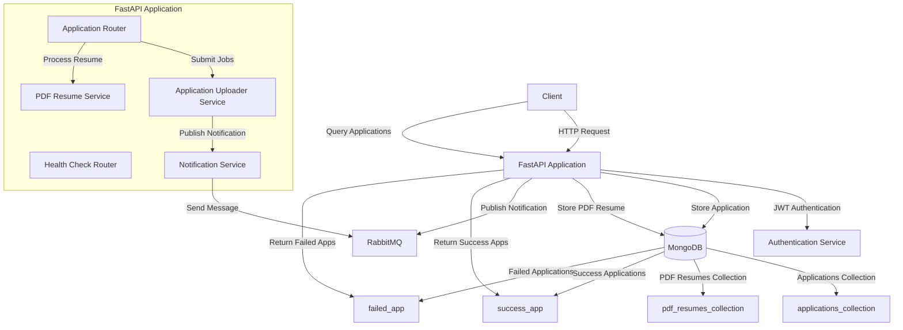
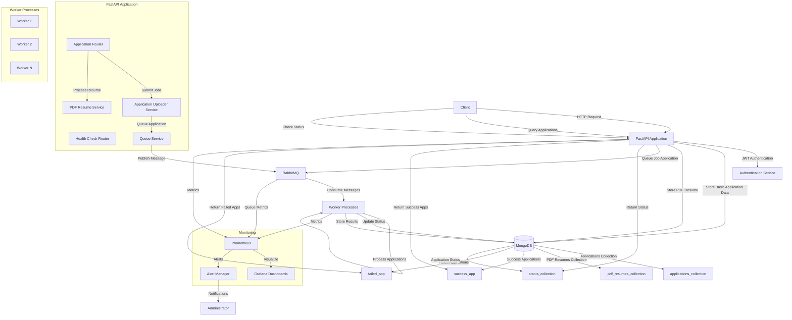
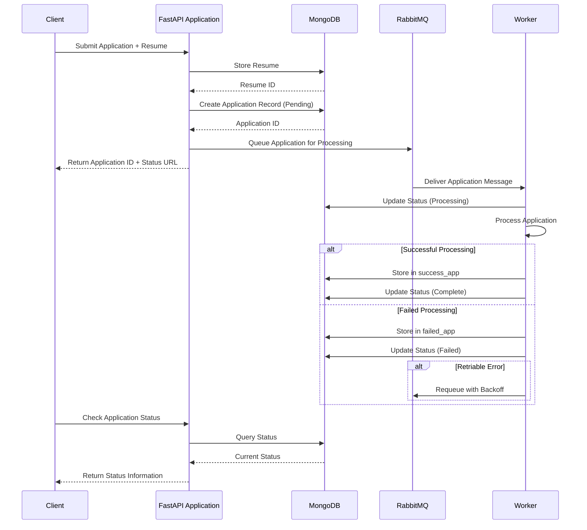

# System Architecture - Application Manager Service

This document provides a visual representation of the Application Manager Service architecture, both current and proposed future state.

## Current System Architecture

The current architecture follows a synchronous processing model where API requests are processed immediately. Below is a diagram illustrating the current architecture:

## Proposed Future Architecture

The proposed architecture introduces asynchronous processing using a worker-based system, enhancing scalability and resilience:

## Data Flow - Current State

1. Client submits a job application request with optional PDF resume
2. Application Router validates the request and extracts job data
3. If a PDF is included, PDF Resume Service stores it in MongoDB
4. Application Uploader Service stores the application data in MongoDB
5. Notification Service publishes a message to RabbitMQ
6. Client receives success/failure response immediately
7. The process that transitions applications between pending/success/failure states is not clearly defined in the current architecture

## Data Flow - Future State

1. Client submits a job application request with optional PDF resume
2. Application Router validates the request and extracts job data
3. If a PDF is included, PDF Resume Service stores it in MongoDB
4. Application Uploader Service creates a basic application record with "pending" status
5. Queue Service publishes the application to RabbitMQ for processing
6. Client receives acknowledgment with a tracking ID immediately
7. Worker processes consume messages from RabbitMQ
8. Workers process applications asynchronously:
   - Validate application data
   - Process resume data
   - Update application status throughout processing
   - Store final results in success_app or failed_app collections
9. Client can query the status of their application using the tracking ID
10. Monitoring system tracks the health and performance of all components

## Sequence Diagram - Application Submission (Future State)

## Component Responsibilities

### Current Components

| Component | Responsibility |
|-----------|----------------|
| Application Router | Handles API endpoints for submitting and retrieving applications |
| PDF Resume Service | Stores and retrieves PDF resumes |
| Application Uploader Service | Stores application data in MongoDB |
| Notification Service | Publishes messages to RabbitMQ |
| MongoDB | Stores application data, resumes, and results |
| RabbitMQ | Handles notification publishing |

### Future Components

| Component | Responsibility |
|-----------|----------------|
| Application Router | Handles API endpoints, initial validation |
| PDF Resume Service | Stores and retrieves PDF resumes |
| Application Uploader Service | Creates initial application records |
| Queue Service | Publishes application messages to RabbitMQ |
| Status Service | Tracks and reports application status |
| Worker Processes | Process applications asynchronously |
| MongoDB | Stores application data, resumes, results, and status |
| RabbitMQ | Message broker for application processing |
| Monitoring System | Tracks health and performance metrics |

## Scaling Considerations

The proposed architecture offers several scaling advantages:

1. **API Tier Scaling**: Since API requests return quickly, the API tier can handle more concurrent requests with fewer resources
2. **Worker Scaling**: Workers can be scaled independently based on queue depth
3. **Database Optimization**: With asynchronous processing, database operations can be optimized and batched
4. **Resilience**: Failed operations can be retried without user impact
5. **Prioritization**: Different application types can be prioritized in the queue

## Security Considerations

The architecture should maintain the following security features:

1. **Authentication**: JWT-based authentication for all client requests
2. **Authorization**: Role-based access control for administrative endpoints
3. **Data Protection**: Secure storage of resume data
4. **API Protection**: Rate limiting, input validation, and request sanitization
5. **Worker Security**: Secure communication between workers and other components